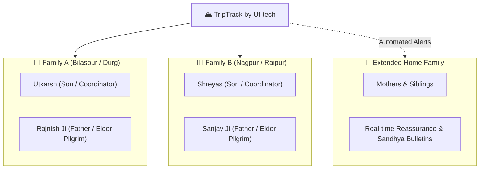
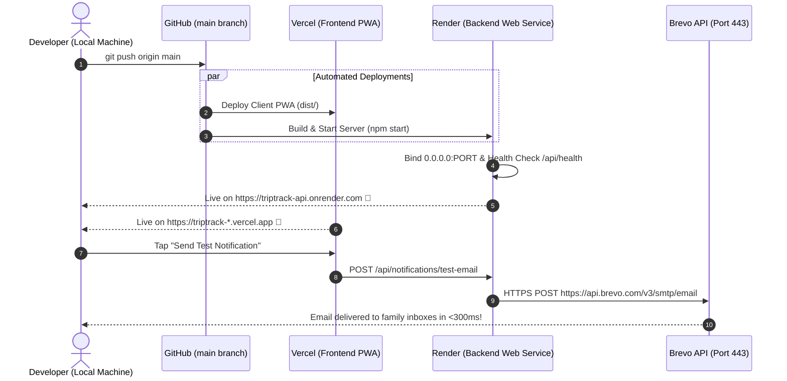

# 🏔️ TripTrack by Ut-tech — Project Instructions & Developer Guide

> **Mission:** Private, Offline-First Mobile PWA for the Sacred Badrinath Dham Pilgrimage 2026 (Sep 24 – Oct 02, 2026).  
> **Travellers:** 4 Pilgrims across 2 Paired Families + Extended Home Family (4–8 members total).  
> **Philosophy:** Elder Dignity, Zero-Signal Resilience (NH-7 Alaknanda Valley), and Zero-Cost Cloud Production.

---

## 📑 Table of Contents
1. [Project Overview & Family Architecture](#1-project-overview--family-architecture)
2. [Technology Stack & Zero-Cost Architecture](#2-technology-stack--zero-cost-architecture)
3. [Repository Structure](#3-repository-structure)
4. [Essential Commands Cheatsheet](#4-essential-commands-cheatsheet)
5. [Environment Variables Reference](#5-environment-variables-reference)
6. [Core Workflows & Subsystems](#6-core-workflows--subsystems)
   - [Offline-First Local Storage (Dexie.js)](#61-offline-first-local-storage-dexiejs)
   - [Brevo HTTPS Email Automation Engine](#62-brevo-https-email-automation-engine)
   - [Fintech Gullak (Splitwise-Grade Pool)](#63-fintech-gullak-splitwise-grade-pool)
   - [Transit Engines (Train 12441 & IndiGo Flights)](#64-transit-engines-train-12441--indigo-flights)
   - [Himalayan Route Guard & Live Feed](#65-himalayan-route-guard--live-feed)
   - [In-Family Real-Time Chat & Media Hub](#66-in-family-real-time-chat--media-hub)
7. [Deployment & Production Lifecycle](#7-deployment--production-lifecycle)
8. [Mandatory Architectural Invariants](#8-mandatory-architectural-invariants)

---

## 1. Project Overview & Family Architecture

TripTrack coordinates travel, logistics, health, documents, finances, and communication for two paired families travelling together:



### Roles & Responsibilities:
- **Family A:** Utkarsh (Primary Tech & Route Coordinator) & Rajnish Ji (Senior Pilgrim, daily BP meds, warm hydration).
- **Family B:** Shreyas (Ground Logistics & Cab Coordinator) & Sanjay Ji (Senior Pilgrim, altitude pacing).
- **Home Family:** Receives automated arrival alerts, daily evening digests ("Sandhya Bulletin"), and GPS SOS alerts via Brevo HTTPS email.

---

## 2. Technology Stack & Zero-Cost Architecture

The entire stack is designed to run on **100% free-tier cloud infrastructure**:

| Layer | Technology | Free Tier Provider | Purpose |
| :--- | :--- | :--- | :--- |
| **Frontend PWA** | React 19, TypeScript, Vite 6, Tailwind CSS | Vercel (`*.vercel.app`) | Ultra-fast mobile UI, Workbox PWA service worker caching |
| **Local Storage** | `Dexie.js` (IndexedDB) | Browser Client-Side | 100% offline access to travel passes, PDFs, tickets & telemetry |
| **Backend API** | Node.js 20.x, Express, TypeScript | Render (`https://triptrack-api.onrender.com`) | Central REST API & Background Pilgrimage Automation |
| **Real-time Sync** | `Socket.io` (v4) | Render Web Service | Instant live in-family room synchronization |
| **Database** | MongoDB Atlas (M0 Free Tier) | MongoDB Cloud | Central persistence for chat, telemetry, expenses & seed data |
| **Media Storage** | Cloudinary Free Tier | Cloudinary | Auto-compressed receipts, photo stream moments & audio notes |
| **Generative AI** | `@google/genai` (`gemini-2.5-flash`) | Google AI Studio | Document parsing, route danger analysis & news briefing |
| **Maps & Tiles** | Leaflet + OpenStreetMap tiles | OpenStreetMap (Zero Billing) | Full-bleed interactive maps & offline polyline tracking |
| **Email Delivery** | Brevo HTTPS REST API (Port 443) | Brevo (300 emails/day free) | Autonomous morning briefs, GPS geofencing & SOS beacons |

---

## 3. Repository Structure

```text
TripTrack/
├── client/                     # Mobile-First React PWA Workspace
│   ├── public/                 # PWA icons, manifest, service worker assets
│   ├── src/
│   │   ├── components/         # UI Modals, Cards, Navbars, Header, Sidebar
│   │   │   ├── EmailAlertsModal.tsx  # Automation triggers, geofence testing
│   │   │   ├── EmergencyModal.tsx    # 1-Tap GPS SOS Beacon
│   │   │   ├── GullakTab.tsx         # Splitwise multi-payer expense engine
│   │   │   └── ...
│   │   ├── shared/
│   │   │   ├── config/         # Travellers config, geofences, waypoints
│   │   │   ├── db/dexie.ts     # Client-side IndexedDB schemas & storage
│   │   │   ├── services/       # API config, socket service, offline sync
│   │   │   └── types/          # Shared TypeScript interfaces
│   │   └── index.css           # Tailwind custom alpine tokens & safe areas
│   ├── package.json
│   ├── vite.config.ts
│   └── vercel.json             # API proxy rewrites to Render backend
├── server/                     # Express & Node.js Backend Workspace
│   ├── src/
│   │   ├── modules/
│   │   │   ├── notifications/  # Brevo HTTPS engine & 60s autonomous scheduler
│   │   │   ├── gullak/         # Multi-payer settlement calculation logic
│   │   │   ├── itinerary/      # Train 12441 & flight transit trackers
│   │   │   ├── tracking/       # GPS ping ingestion & dead-zone batch sync
│   │   │   └── ...
│   │   ├── shared/             # MongoDB client, auth PIN middleware, rate limiter
│   │   ├── app.ts              # Express application routing & public health check
│   │   └── index.ts            # Server boot, 0.0.0.0 host binding, DNS IPv4 order
│   ├── package.json
│   ├── tsconfig.json
│   └── .env                    # Local environment secrets
├── render.yaml                 # Render Blueprint configuration
├── vercel.json                 # Monorepo root routing & API rewrites
├── progress_tracker.md         # Mandatory project development roadmap tracker
└── GEMINI.md                   # Mandatory workspace rules & invariants
```

---

## 4. Essential Commands Cheatsheet

All commands run directly in PowerShell / terminal without asking for permission:

### Monorepo Root:
```powershell
# Install all dependencies across client and server
npm install

# Run both client and server concurrently in development
npm run dev

# Build both client and server for production validation
npm run build
```

### Client (`client/`):
```powershell
# Launch Vite PWA dev server (http://localhost:5173)
npm --prefix client run dev

# Type-check and compile Vite PWA bundle
npm --prefix client run build

# Preview production client locally
npm --prefix client run preview
```

### Server (`server/`):
```powershell
# Launch Express dev server with hot-reload (ts-node-dev)
npm --prefix server run dev

# Compile TypeScript to dist/
npm --prefix server run build

# Run compiled server in production mode
npm --prefix server start
```

### Git & Deployment:
```powershell
# Check git status
git status

# Stage, commit, and push changes to trigger auto-deployments
git add .
git commit -m "feat(scope): descriptive summary"
git push origin main
```

---

## 5. Environment Variables Reference

### Server (`server/.env` & Render Dashboard):
| Variable | Example / Format | Purpose |
| :--- | :--- | :--- |
| `PORT` | `5000` | Port for Express HTTP & Socket.io (Render overrides dynamically) |
| `NODE_ENV` | `production` / `development` | Runtime environment flag |
| `MONGODB_URI` | `mongodb+srv://<user>:<pwd>@atlas...` | MongoDB Atlas M0 cluster connection string |
| `FAMILY_PIN` | `2026` | 4-digit PIN protecting mutation APIs (passes automatically from client) |
| `GEMINI_API_KEY` | `AIzaSy...` / `AQ.Ab8...` | Google AI Studio free key for document parsing and AI route alerts |
| `BREVO_API_KEY` | `xkeysib-...` | Brevo v3 API key for sending emails via Port 443 HTTPS |
| `SMTP_USER` | `utkarshsofficial13@gmail.com` | Verified sender email address |
| `SMTP_APP_PASSWORD`| `16-char-app-password` | Gmail App Password (fallback for local development) |
| `FAMILY_NOTIFICATION_EMAILS` | `email1@gmail.com,email2@gmail.com` | Comma-separated list of family recipient inboxes |
| `CLOUDINARY_URL` | `cloudinary://<key>:<secret>@<cloud>` | Cloudinary credentials for receipt and photo uploads |

### Client (`client/.env` / Vercel Dashboard):
| Variable | Example / Format | Purpose |
| :--- | :--- | :--- |
| `VITE_API_URL` | `https://triptrack-api.onrender.com` | Backend URL (defaults cleanly in `apiConfig.ts`) |
| `VITE_FAMILY_PIN` | `2026` | Default family security PIN |

---

## 6. Core Workflows & Subsystems

### 6.1. Offline-First Local Storage (`Dexie.js`)
- **Zero-Signal Survival:** In the Alaknanda gorge (NH-7 between Devprayag and Joshimath), cellular towers are blocked by rock cliffs.
- **Binary Blob Caching:** Travel tickets (Train 12441 berth pass, IndiGo boarding passes, GMVN hotel vouchers) are stored directly as binary Blobs in client IndexedDB (`dexie.ts`).
- **Telemetry Queue:** GPS pings and checkpoint toggles made while offline are saved to a local Dexie queue. When `useNetworkStatus` detects connectivity, the queue auto-flushes in bulk to `/api/tracking/bulk-ping`.

### 6.2. Brevo HTTPS Email Automation Engine
- **Port 443 Bypass:** Render free tier blocks outbound SMTP ports ($25, 465, 587$). TripTrack uses Brevo's HTTPS REST API (`POST https://api.brevo.com/v3/smtp/email`) on Port 443, ensuring 100% cloud deliverability.
- **Sender Identity:** Branded as `"TripTrack by Ut-tech" <utkarshsofficial13@gmail.com>`.
- **Automated Triggers:**
  - **GPS Geofencing:** Mathematical Haversine formula detects entry within waypoint radius (e.g. Durg 25km, Haridwar 8km, Joshimath 5km, Badrinath Sanctum 3km).
  - **Morning Briefings (6:00 AM):** Sends daily logistics, weather alert, and elder care pacing advice.
  - **Sandhya Bulletin (8:00 PM):** Daily evening recap of milestones covered, expenses logged, photos uploaded, and elders' vitals ($SpO_2$/BP).
  - **Emergency SOS Beacon:** Instant broadcast of live GPS coordinates, battery level, and elders' medical dossier.

### 6.3. Fintech Gullak (Splitwise-Grade Pool)
- **Multi-Payer Scenarios:** Handles split situations where Utkarsh pays ₹200 and Shreyas pays ₹50 for a ₹250 purchase.
- **Custom Split Modes:** Supports 50/50 equal splits, unequal custom amounts, percentage splits, and single-family exclusions.
- **Live Settlement Matrix:** Calculates the exact net balance between Family A and Family B at any time with a 1-tap WhatsApp settlement link.
- **Receipts Vault:** Attaches photo receipts uploaded to Cloudinary.

### 6.4. Transit Engines (Train 12441 & IndiGo Flights)
- **Train 12441 Bilaspur Rajdhani:** Offline berth passes, real-time station progression (Durg $\rightarrow$ Raipur $\rightarrow$ Nagpur $\rightarrow$ Bhopal $\rightarrow$ NDLS), pantry ordering tips, and coach berth maps.
- **Dual-PNR IndiGo Tracker:** Tracks onward connection flights with terminal guidance, baggage claim checkpoints, and gate departure counts.

### 6.5. Himalayan Route Guard & Live Feed
- **Live Highway Monitor:** Monitors NH-7 Chamoli/Joshimath landslide zones, Alaknanda river levels, and weather warnings.
- **Dual-Tab Feed:**
  - *Tab 1 (In-Family Feed):* Private photo stream, audio notes, and pilgrim status updates.
  - *Tab 2 (Live News Scanner):* AI-summarized regional updates regarding Uttarakhand weather and Badrinath temple opening hours.

### 6.6. In-Family Real-Time Chat & Media Hub
- **WebSocket Room:** In-family live room managed via Socket.io with persistent MongoDB storage.
- **WhatsApp Fallback:** Any message, route checkpoint, or SOS beacon can be converted with 1 tap into a pre-formatted WhatsApp text to send over low-bandwidth cellular networks.

---

## 7. Deployment & Production Lifecycle



---

## 8. Mandatory Architectural Invariants

> [!IMPORTANT]
> The following 4 rules must **NEVER** be broken in any PR, commit, or refactoring:

1. **Elder Dignity & Ergonomics First:**
   - Touch targets must strictly remain $\ge 48\text{px}$ (`min-h-touch min-w-touch`).
   - High-contrast daylight readability for senior fathers (Rajnish Ji & Sanjay Ji).
   - Respect mobile safe-area insets (`env(safe-area-inset-top)` and `env(safe-area-inset-bottom)`).
2. **Local-First Supremacy (Zero-Signal Resilience):**
   - The app must function 100% offline in dead zones.
   - All critical passes and documents must be accessible without network via IndexedDB.
   - Telemetry, pings, and checkpoints must silently queue locally and auto-flush on reconnect.
3. **Paired Family Identity:**
   - Always preserve distinct tagging between **Family A** (Utkarsh & Rajnish Ji) and **Family B** (Shreyas & Sanjay Ji).
4. **Zero-Cost Production Stack:**
   - Only free-tier APIs and infrastructure are permitted (Brevo free tier, MongoDB Atlas M0, Google AI Studio free tier, OpenStreetMap tiles, Vercel & Render free plans).

---

*Authored with devotion for the Badrinath Dham Sacred Yatra 2026 by Ut-tech.*
